# Personal financial control — Use case diagrams

**Status:** Draft · **Last updated:** 2026-09-27 · **Source:** the use cases in [use-cases/](use-cases/)

Diagrams of every use case in [use-cases/](use-cases/), drawn with
[Mermaid](https://mermaid.js.org/). Each diagram follows the main flow of its
use case, with its alternate flows (AF) and exception flows (EF) as branches.
The use case text remains the reference: when a diagram and the text
disagree, the text wins and the diagram must be fixed.

## How to read the diagrams

| Shape / colour           | Meaning                                              |
|--------------------------|------------------------------------------------------|
| Blue rectangle           | Something the user does                              |
| Grey rectangle           | Something the system does                            |
| Diamond                  | A check or a choice                                  |
| Yellow rectangle         | An alternate flow (AF)                               |
| Red rounded box          | An exception flow (EF): the flow ends or goes back   |
| Green rounded box        | The flow ends successfully                           |
| Dashed arrow             | Leads to another use case                            |

Two checks apply to many use cases and are drawn only where they matter:

- **Not authenticated** — every use case starts by checking that the user is
  signed in (PRE-01). This check is left out of the diagrams.
- **Earlier month pending** — every use case that writes data refuses to
  work in a month later than a pending one ([Glossary](glossary.md), "Pending month lock").
  It is checked as soon as the user starts, and again on confirmation; the
  diagrams show it once, at the start.

## Contents

- [Overview](#overview)
  - [Navigation map](#navigation-map)
  - [Life cycle of an expense or income](#life-cycle-of-an-expense-or-income)
  - [Life cycle of an accounting month](#life-cycle-of-an-accounting-month)
  - [Life cycle of a credit card bill](#life-cycle-of-a-credit-card-bill)
- [Bank accounts](#bank-accounts) — UC-01 to UC-05
- [Credit cards](#credit-cards) — UC-06 to UC-10
- [Categories](#categories) — UC-11 to UC-14
- [Expenses](#expenses) — UC-15 to UC-23
- [Incomes](#incomes) — UC-24 to UC-28
- [Credit card bills](#credit-card-bills) — UC-29 to UC-32
- [Accounting months](#accounting-months) — UC-33 to UC-37
- [Overview and tools](#overview-and-tools) — UC-38 to UC-40
- [Automated processes](#automated-processes) — UC-41 to UC-43

---

## Overview

### Navigation map

Where each screen leads. Menus are at the top; arrows go from the screen
where an action starts to the use case it opens.

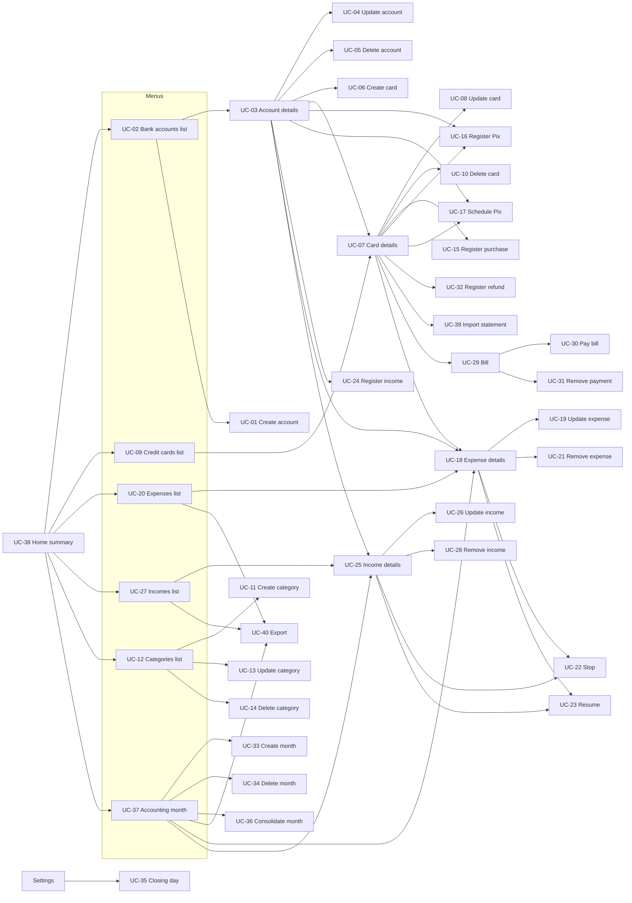
```mermaid
flowchart LR
    HOME["UC-38 Home summary"]
    subgraph Menus
        M1["UC-02 Bank accounts list"]
        M2["UC-09 Credit cards list"]
        M3["UC-20 Expenses list"]
        M4["UC-27 Incomes list"]
        M5["UC-12 Categories list"]
        M6["UC-37 Accounting month"]
    end
    HOME --> M1 & M2 & M3 & M4 & M5 & M6
    M1 --> ACC["UC-03 Account details"]
    M1 --> C01["UC-01 Create account"]
    ACC --> C04["UC-04 Update account"]
    ACC --> C05["UC-05 Delete account"]
    ACC --> C06["UC-06 Create card"]
    ACC --> CARD["UC-07 Card details"]
    ACC --> C16["UC-16 Register Pix"]
    ACC --> C17["UC-17 Schedule Pix"]
    ACC --> C24["UC-24 Register income"]
    ACC --> EXP["UC-18 Expense details"]
    ACC --> INC["UC-25 Income details"]
    M2 --> CARD
    CARD --> C08["UC-08 Update card"]
    CARD --> C10["UC-10 Delete card"]
    CARD --> C15["UC-15 Register purchase"]
    CARD --> C16
    CARD --> C17
    CARD --> C32["UC-32 Register refund"]
    CARD --> C39["UC-39 Import statement"]
    CARD --> BILL["UC-29 Bill"]
    CARD --> EXP
    BILL --> C30["UC-30 Pay bill"]
    BILL --> C31["UC-31 Remove payment"]
    M3 --> EXP
    M3 --> C40["UC-40 Export"]
    EXP --> C19["UC-19 Update expense"]
    EXP --> C21["UC-21 Remove expense"]
    EXP --> C22["UC-22 Stop"]
    EXP --> C23["UC-23 Resume"]
    M4 --> INC
    M4 --> C40
    INC --> C26["UC-26 Update income"]
    INC --> C28["UC-28 Remove income"]
    INC --> C22
    INC --> C23
    M5 --> C11["UC-11 Create category"]
    M5 --> C13["UC-13 Update category"]
    M5 --> C14["UC-14 Delete category"]
    M6 --> C33["UC-33 Create month"]
    M6 --> C34["UC-34 Delete month"]
    M6 --> C36["UC-36 Consolidate month"]
    M6 --> C40
    M6 --> EXP
    M6 --> INC
    SET["Settings"] --> C35["UC-35 Closing day"]
```

### Life cycle of an expense or income

States from the Glossary ("Expense states"). *Scheduled* applies to Pix only;
*Stopped* applies to recurring entries only.

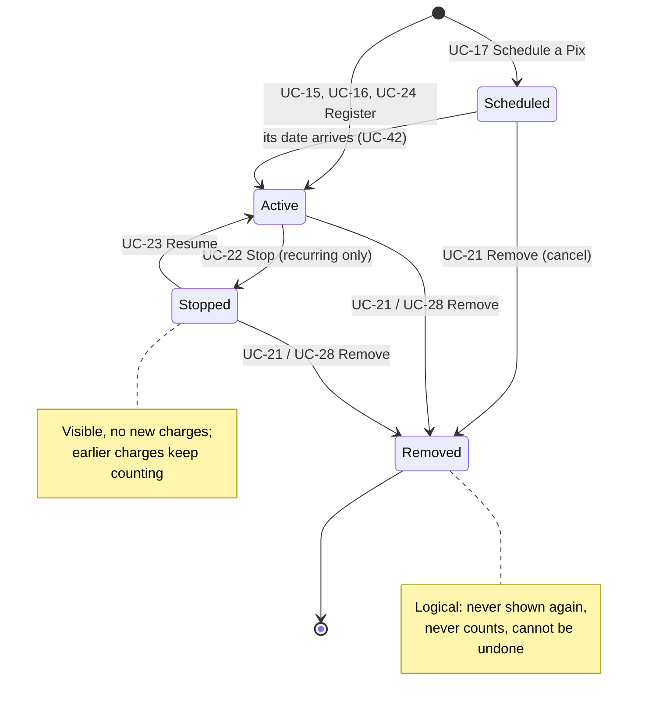
```mermaid
stateDiagram-v2
    [*] --> Scheduled: UC-17 Schedule a Pix
    [*] --> Active: UC-15, UC-16, UC-24 Register
    Scheduled --> Active: its date arrives (UC-42)
    Scheduled --> Removed: UC-21 Remove (cancel)
    Active --> Stopped: UC-22 Stop (recurring only)
    Stopped --> Active: UC-23 Resume
    Active --> Removed: UC-21 / UC-28 Remove
    Stopped --> Removed: UC-21 / UC-28 Remove
    Removed --> [*]
    note right of Removed
        Logical: never shown again,
        never counts, cannot be undone
    end note
    note right of Stopped
        Visible, no new charges;
        earlier charges keep counting
    end note
```

A single month of a recurring entry can also be removed (UC-21, UC-28): that
charge or receipt becomes a *removed month* while the entry stays in its
state.

### Life cycle of an accounting month

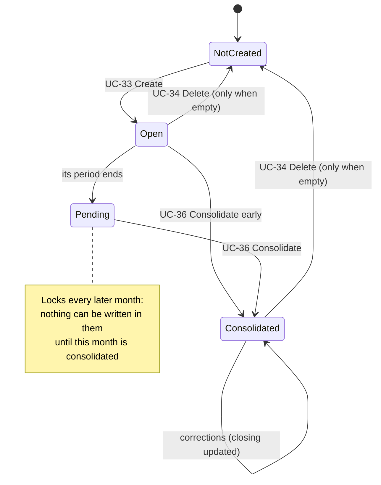
```mermaid
stateDiagram-v2
    [*] --> NotCreated
    NotCreated --> Open: UC-33 Create
    Open --> NotCreated: UC-34 Delete (only when empty)
    Open --> Pending: its period ends
    Open --> Consolidated: UC-36 Consolidate early
    Pending --> Consolidated: UC-36 Consolidate
    Consolidated --> NotCreated: UC-34 Delete (only when empty)
    Consolidated --> Consolidated: corrections (closing updated)
    note right of Pending
        Locks every later month:
        nothing can be written in them
        until this month is consolidated
    end note
```

### Life cycle of a credit card bill

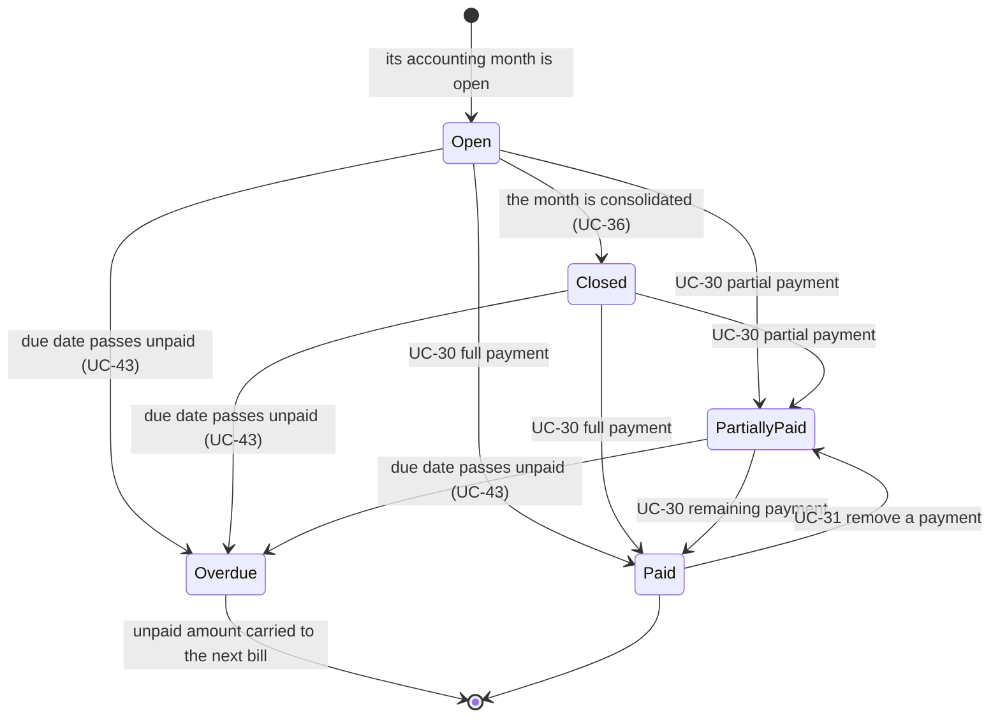
```mermaid
stateDiagram-v2
    [*] --> Open: its accounting month is open
    Open --> Closed: the month is consolidated (UC-36)
    Open --> PartiallyPaid: UC-30 partial payment
    Closed --> PartiallyPaid: UC-30 partial payment
    Open --> Paid: UC-30 full payment
    Closed --> Paid: UC-30 full payment
    PartiallyPaid --> Paid: UC-30 remaining payment
    Open --> Overdue: due date passes unpaid (UC-43)
    Closed --> Overdue: due date passes unpaid (UC-43)
    PartiallyPaid --> Overdue: due date passes unpaid (UC-43)
    Overdue --> [*]: unpaid amount carried to the next bill
    Paid --> [*]
    Paid --> PartiallyPaid: UC-31 remove a payment
```

---

## Bank accounts

### UC-01 — Create a bank account

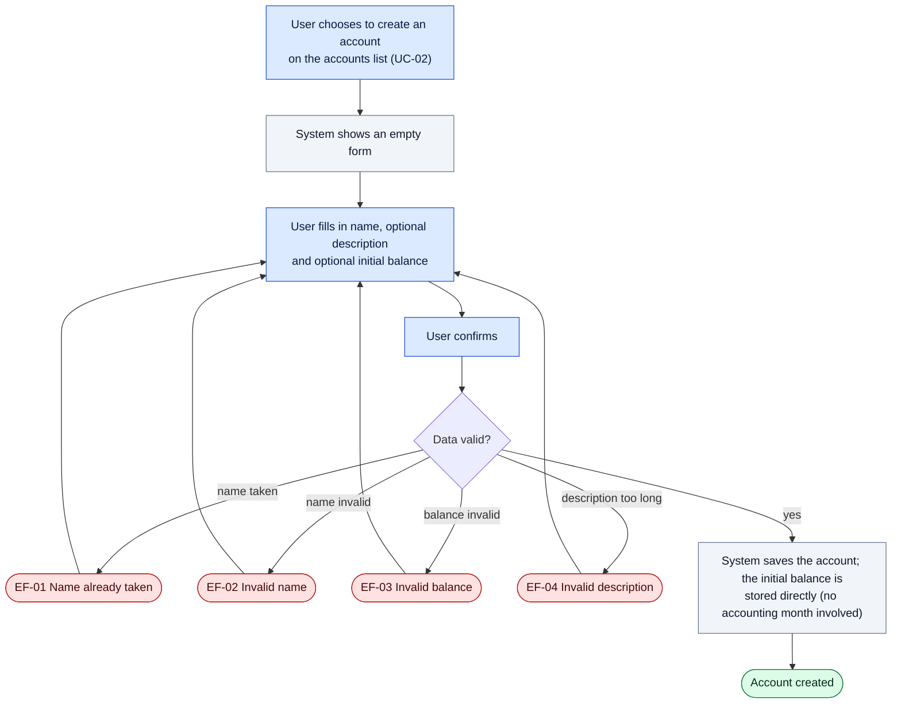
```mermaid
flowchart TD
    A["User chooses to create an account<br/>on the accounts list (UC-02)"]:::user --> B["System shows an empty form"]:::sys
    B --> C["User fills in name, optional description<br/>and optional initial balance"]:::user
    C --> D["User confirms"]:::user
    D --> V{"Data valid?"}
    V -->|"name taken"| E1(["EF-01 Name already taken"]):::exc --> C
    V -->|"name invalid"| E2(["EF-02 Invalid name"]):::exc --> C
    V -->|"balance invalid"| E3(["EF-03 Invalid balance"]):::exc --> C
    V -->|"description too long"| E4(["EF-04 Invalid description"]):::exc --> C
    V -->|yes| S["System saves the account; the initial balance is<br/>stored directly (no accounting month involved)"]:::sys
    S --> OK(["Account created"]):::ok
    classDef user fill:#dbeafe,stroke:#1d4ed8,color:#0b1b3f
    classDef sys fill:#f1f5f9,stroke:#64748b,color:#0f172a
    classDef alt fill:#fef3c7,stroke:#b45309,color:#3b2505
    classDef exc fill:#fee2e2,stroke:#b91c1c,color:#450a0a
    classDef ok fill:#dcfce7,stroke:#15803d,color:#052e16
```

### UC-02 — List bank accounts

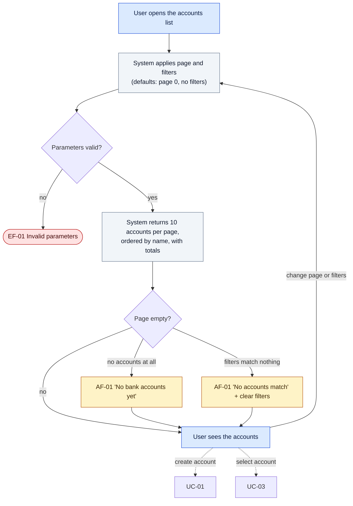
```mermaid
flowchart TD
    A["User opens the accounts list"]:::user --> B["System applies page and filters<br/>(defaults: page 0, no filters)"]:::sys
    B --> V{"Parameters valid?"}
    V -->|no| E1(["EF-01 Invalid parameters"]):::exc
    V -->|yes| R["System returns 10 accounts per page,<br/>ordered by name, with totals"]:::sys
    R --> EMP{"Page empty?"}
    EMP -->|"no accounts at all"| AF1a["AF-01 'No bank accounts yet'"]:::alt
    EMP -->|"filters match nothing"| AF1b["AF-01 'No accounts match' + clear filters"]:::alt
    EMP -->|no| SHOW["User sees the accounts"]:::user
    AF1a --> SHOW
    AF1b --> SHOW
    SHOW -->|"change page or filters"| B
    SHOW -.->|"create account"| U01["UC-01"]
    SHOW -.->|"select account"| U03["UC-03"]
    classDef user fill:#dbeafe,stroke:#1d4ed8,color:#0b1b3f
    classDef sys fill:#f1f5f9,stroke:#64748b,color:#0f172a
    classDef alt fill:#fef3c7,stroke:#b45309,color:#3b2505
    classDef exc fill:#fee2e2,stroke:#b91c1c,color:#450a0a
    classDef ok fill:#dcfce7,stroke:#15803d,color:#052e16
```

### UC-03 — View bank account details

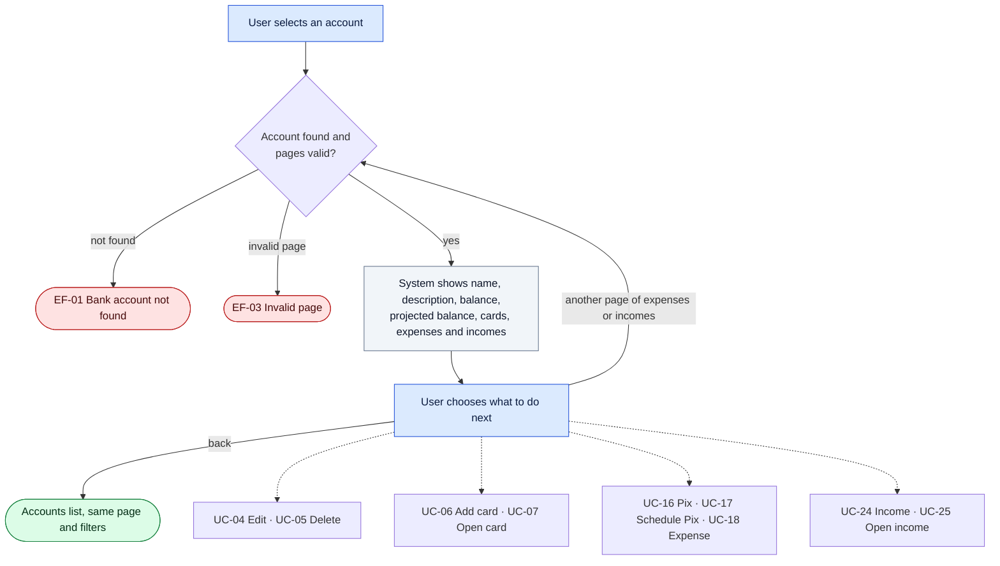
```mermaid
flowchart TD
    A["User selects an account"]:::user --> F{"Account found and<br/>pages valid?"}
    F -->|"not found"| E1(["EF-01 Bank account not found"]):::exc
    F -->|"invalid page"| E3(["EF-03 Invalid page"]):::exc
    F -->|yes| S["System shows name, description, balance,<br/>projected balance, cards, expenses and incomes"]:::sys
    S --> U["User chooses what to do next"]:::user
    U -->|"another page of expenses or incomes"| F
    U -->|"back"| BACK(["Accounts list, same page and filters"]):::ok
    U -.-> N1["UC-04 Edit · UC-05 Delete"]
    U -.-> N2["UC-06 Add card · UC-07 Open card"]
    U -.-> N3["UC-16 Pix · UC-17 Schedule Pix · UC-18 Expense"]
    U -.-> N4["UC-24 Income · UC-25 Open income"]
    classDef user fill:#dbeafe,stroke:#1d4ed8,color:#0b1b3f
    classDef sys fill:#f1f5f9,stroke:#64748b,color:#0f172a
    classDef alt fill:#fef3c7,stroke:#b45309,color:#3b2505
    classDef exc fill:#fee2e2,stroke:#b91c1c,color:#450a0a
    classDef ok fill:#dcfce7,stroke:#15803d,color:#052e16
```

### UC-04 — Update a bank account

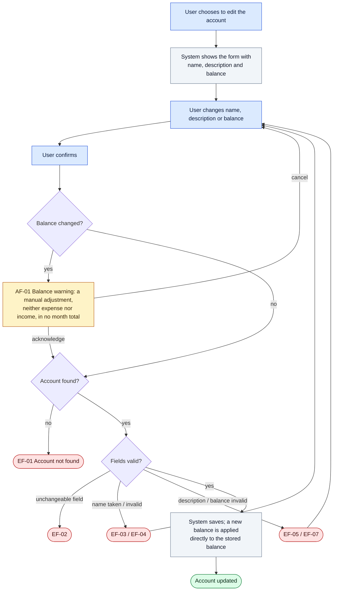
```mermaid
flowchart TD
    A["User chooses to edit the account"]:::user --> B["System shows the form with<br/>name, description and balance"]:::sys
    B --> C["User changes name, description or balance"]:::user
    C --> D["User confirms"]:::user
    D --> W{"Balance changed?"}
    W -->|yes| AF1["AF-01 Balance warning: a manual adjustment,<br/>neither expense nor income, in no month total"]:::alt
    AF1 -->|cancel| C
    AF1 -->|acknowledge| F
    W -->|no| F{"Account found?"}
    F -->|no| E1(["EF-01 Account not found"]):::exc
    F -->|yes| V{"Fields valid?"}
    V -->|"unchangeable field"| E2(["EF-02"]):::exc
    V -->|"name taken / invalid"| E34(["EF-03 / EF-04"]):::exc --> C
    V -->|"description / balance invalid"| E57(["EF-05 / EF-07"]):::exc --> C
    V -->|yes| S["System saves; a new balance is applied<br/>directly to the stored balance"]:::sys
    S --> OK(["Account updated"]):::ok
    classDef user fill:#dbeafe,stroke:#1d4ed8,color:#0b1b3f
    classDef sys fill:#f1f5f9,stroke:#64748b,color:#0f172a
    classDef alt fill:#fef3c7,stroke:#b45309,color:#3b2505
    classDef exc fill:#fee2e2,stroke:#b91c1c,color:#450a0a
    classDef ok fill:#dcfce7,stroke:#15803d,color:#052e16
```

### UC-05 — Delete a bank account

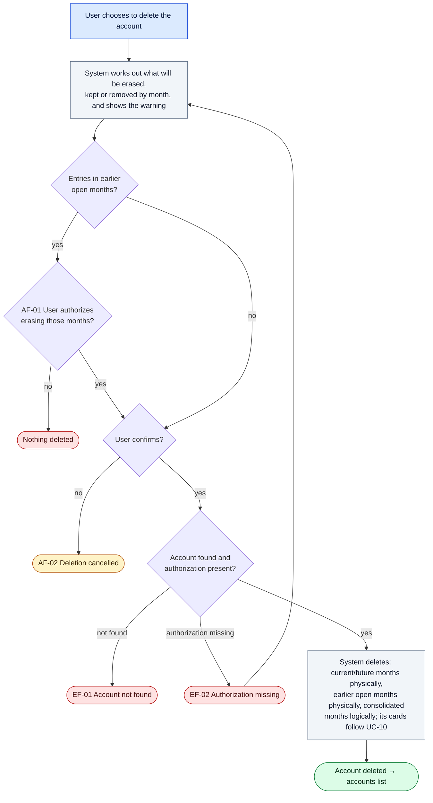
```mermaid
flowchart TD
    A["User chooses to delete the account"]:::user --> B["System works out what will be erased,<br/>kept or removed by month, and shows the warning"]:::sys
    B --> P{"Entries in earlier<br/>open months?"}
    P -->|yes| AF1{"AF-01 User authorizes<br/>erasing those months?"}
    AF1 -->|no| STAY(["Nothing deleted"]):::exc
    AF1 -->|yes| C
    P -->|no| C{"User confirms?"}
    C -->|no| AF2(["AF-02 Deletion cancelled"]):::alt
    C -->|yes| F{"Account found and<br/>authorization present?"}
    F -->|"not found"| E1(["EF-01 Account not found"]):::exc
    F -->|"authorization missing"| E2(["EF-02 Authorization missing"]):::exc --> B
    F -->|yes| S["System deletes: current/future months physically,<br/>earlier open months physically, consolidated<br/>months logically; its cards follow UC-10"]:::sys
    S --> OK(["Account deleted → accounts list"]):::ok
    classDef user fill:#dbeafe,stroke:#1d4ed8,color:#0b1b3f
    classDef sys fill:#f1f5f9,stroke:#64748b,color:#0f172a
    classDef alt fill:#fef3c7,stroke:#b45309,color:#3b2505
    classDef exc fill:#fee2e2,stroke:#b91c1c,color:#450a0a
    classDef ok fill:#dcfce7,stroke:#15803d,color:#052e16
```

---

## Credit cards

### UC-06 — Create a credit card

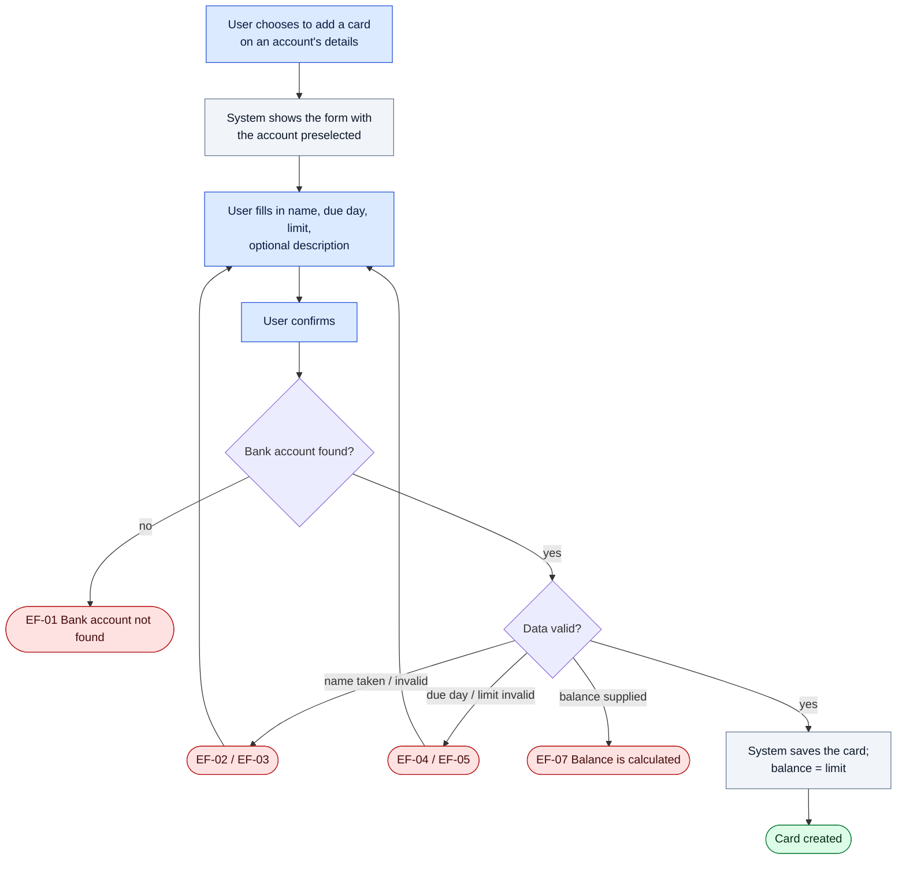
```mermaid
flowchart TD
    A["User chooses to add a card<br/>on an account's details"]:::user --> B["System shows the form with<br/>the account preselected"]:::sys
    B --> C["User fills in name, due day, limit,<br/>optional description"]:::user
    C --> D["User confirms"]:::user
    D --> F{"Bank account found?"}
    F -->|no| E1(["EF-01 Bank account not found"]):::exc
    F -->|yes| V{"Data valid?"}
    V -->|"name taken / invalid"| E23(["EF-02 / EF-03"]):::exc --> C
    V -->|"due day / limit invalid"| E45(["EF-04 / EF-05"]):::exc --> C
    V -->|"balance supplied"| E7(["EF-07 Balance is calculated"]):::exc
    V -->|yes| S["System saves the card;<br/>balance = limit"]:::sys
    S --> OK(["Card created"]):::ok
    classDef user fill:#dbeafe,stroke:#1d4ed8,color:#0b1b3f
    classDef sys fill:#f1f5f9,stroke:#64748b,color:#0f172a
    classDef alt fill:#fef3c7,stroke:#b45309,color:#3b2505
    classDef exc fill:#fee2e2,stroke:#b91c1c,color:#450a0a
    classDef ok fill:#dcfce7,stroke:#15803d,color:#052e16
```

### UC-07 — View credit card details

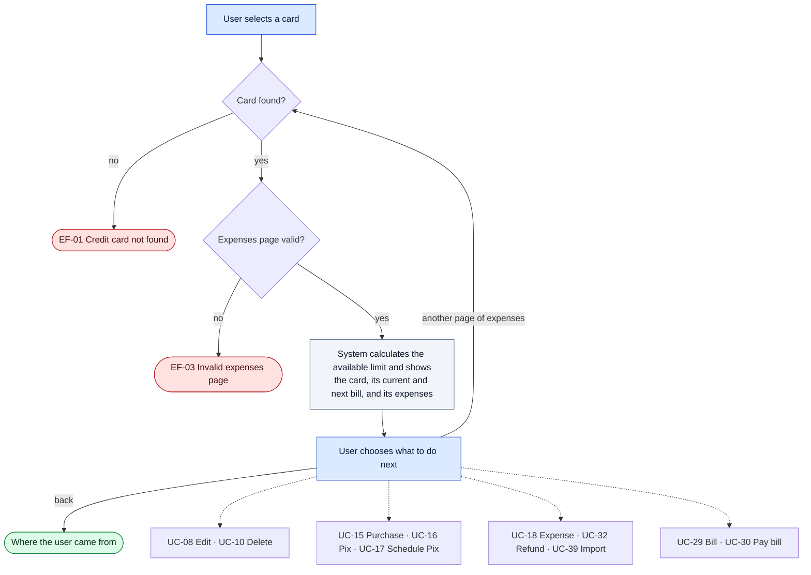
```mermaid
flowchart TD
    A["User selects a card"]:::user --> F{"Card found?"}
    F -->|no| E1(["EF-01 Credit card not found"]):::exc
    F -->|yes| P{"Expenses page valid?"}
    P -->|no| E3(["EF-03 Invalid expenses page"]):::exc
    P -->|yes| S["System calculates the available limit and shows<br/>the card, its current and next bill, and its expenses"]:::sys
    S --> U["User chooses what to do next"]:::user
    U -->|"another page of expenses"| F
    U -->|back| BACK(["Where the user came from"]):::ok
    U -.-> N1["UC-08 Edit · UC-10 Delete"]
    U -.-> N2["UC-15 Purchase · UC-16 Pix · UC-17 Schedule Pix"]
    U -.-> N3["UC-18 Expense · UC-32 Refund · UC-39 Import"]
    U -.-> N4["UC-29 Bill · UC-30 Pay bill"]
    classDef user fill:#dbeafe,stroke:#1d4ed8,color:#0b1b3f
    classDef sys fill:#f1f5f9,stroke:#64748b,color:#0f172a
    classDef alt fill:#fef3c7,stroke:#b45309,color:#3b2505
    classDef exc fill:#fee2e2,stroke:#b91c1c,color:#450a0a
    classDef ok fill:#dcfce7,stroke:#15803d,color:#052e16
```

### UC-08 — Update a credit card

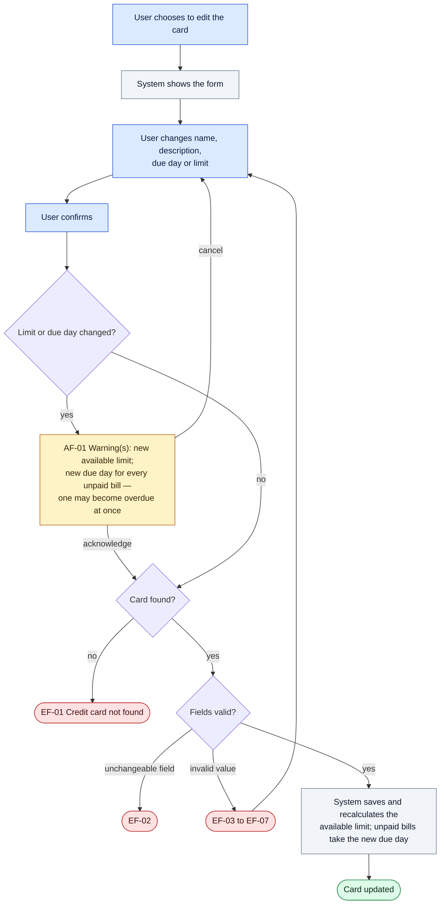
```mermaid
flowchart TD
    A["User chooses to edit the card"]:::user --> B["System shows the form"]:::sys
    B --> C["User changes name, description,<br/>due day or limit"]:::user
    C --> D["User confirms"]:::user
    D --> W{"Limit or due day changed?"}
    W -->|yes| AF1["AF-01 Warning(s): new available limit;<br/>new due day for every unpaid bill —<br/>one may become overdue at once"]:::alt
    AF1 -->|cancel| C
    AF1 -->|acknowledge| F
    W -->|no| F{"Card found?"}
    F -->|no| E1(["EF-01 Credit card not found"]):::exc
    F -->|yes| V{"Fields valid?"}
    V -->|"unchangeable field"| E2(["EF-02"]):::exc
    V -->|"invalid value"| E37(["EF-03 to EF-07"]):::exc --> C
    V -->|yes| S["System saves and recalculates the<br/>available limit; unpaid bills take the new due day"]:::sys
    S --> OK(["Card updated"]):::ok
    classDef user fill:#dbeafe,stroke:#1d4ed8,color:#0b1b3f
    classDef sys fill:#f1f5f9,stroke:#64748b,color:#0f172a
    classDef alt fill:#fef3c7,stroke:#b45309,color:#3b2505
    classDef exc fill:#fee2e2,stroke:#b91c1c,color:#450a0a
    classDef ok fill:#dcfce7,stroke:#15803d,color:#052e16
```

### UC-09 — List credit cards

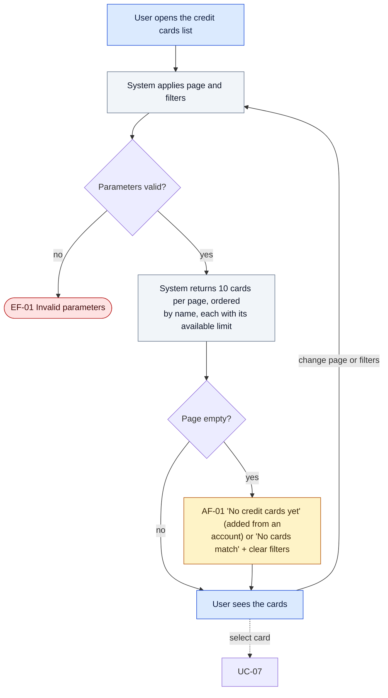
```mermaid
flowchart TD
    A["User opens the credit cards list"]:::user --> B["System applies page and filters"]:::sys
    B --> V{"Parameters valid?"}
    V -->|no| E1(["EF-01 Invalid parameters"]):::exc
    V -->|yes| R["System returns 10 cards per page, ordered<br/>by name, each with its available limit"]:::sys
    R --> EMP{"Page empty?"}
    EMP -->|yes| AF1["AF-01 'No credit cards yet' (added from an<br/>account) or 'No cards match' + clear filters"]:::alt
    EMP -->|no| SHOW["User sees the cards"]:::user
    AF1 --> SHOW
    SHOW -->|"change page or filters"| B
    SHOW -.->|"select card"| U07["UC-07"]
    classDef user fill:#dbeafe,stroke:#1d4ed8,color:#0b1b3f
    classDef sys fill:#f1f5f9,stroke:#64748b,color:#0f172a
    classDef alt fill:#fef3c7,stroke:#b45309,color:#3b2505
    classDef exc fill:#fee2e2,stroke:#b91c1c,color:#450a0a
    classDef ok fill:#dcfce7,stroke:#15803d,color:#052e16
```

### UC-10 — Delete a credit card

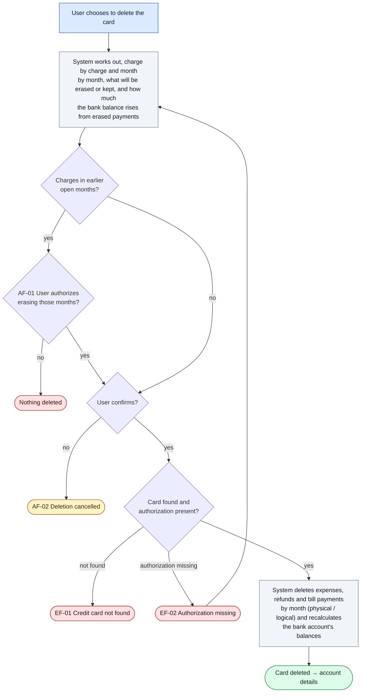
```mermaid
flowchart TD
    A["User chooses to delete the card"]:::user --> B["System works out, charge by charge and month<br/>by month, what will be erased or kept, and how much<br/>the bank balance rises from erased payments"]:::sys
    B --> P{"Charges in earlier<br/>open months?"}
    P -->|yes| AF1{"AF-01 User authorizes<br/>erasing those months?"}
    AF1 -->|no| STAY(["Nothing deleted"]):::exc
    AF1 -->|yes| C
    P -->|no| C{"User confirms?"}
    C -->|no| AF2(["AF-02 Deletion cancelled"]):::alt
    C -->|yes| F{"Card found and<br/>authorization present?"}
    F -->|"not found"| E1(["EF-01 Credit card not found"]):::exc
    F -->|"authorization missing"| E2(["EF-02 Authorization missing"]):::exc --> B
    F -->|yes| S["System deletes expenses, refunds and bill payments<br/>by month (physical / logical) and recalculates<br/>the bank account's balances"]:::sys
    S --> OK(["Card deleted → account details"]):::ok
    classDef user fill:#dbeafe,stroke:#1d4ed8,color:#0b1b3f
    classDef sys fill:#f1f5f9,stroke:#64748b,color:#0f172a
    classDef alt fill:#fef3c7,stroke:#b45309,color:#3b2505
    classDef exc fill:#fee2e2,stroke:#b91c1c,color:#450a0a
    classDef ok fill:#dcfce7,stroke:#15803d,color:#052e16
```

---

## Categories

### UC-11 — Create a category

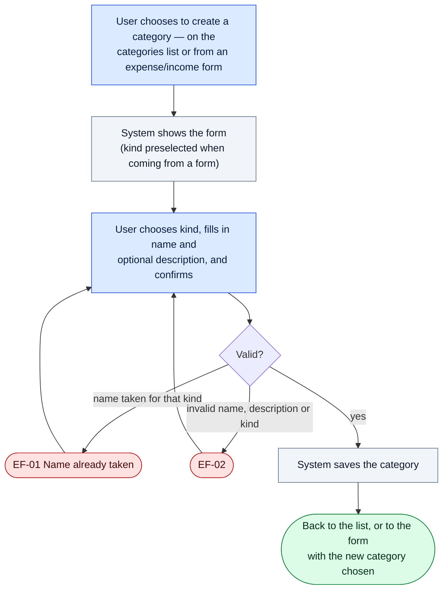
```mermaid
flowchart TD
    A["User chooses to create a category — on the<br/>categories list or from an expense/income form"]:::user --> B["System shows the form<br/>(kind preselected when coming from a form)"]:::sys
    B --> C["User chooses kind, fills in name and<br/>optional description, and confirms"]:::user
    C --> V{"Valid?"}
    V -->|"name taken for that kind"| E1(["EF-01 Name already taken"]):::exc --> C
    V -->|"invalid name, description or kind"| E2(["EF-02"]):::exc --> C
    V -->|yes| S["System saves the category"]:::sys
    S --> OK(["Back to the list, or to the form<br/>with the new category chosen"]):::ok
    classDef user fill:#dbeafe,stroke:#1d4ed8,color:#0b1b3f
    classDef sys fill:#f1f5f9,stroke:#64748b,color:#0f172a
    classDef alt fill:#fef3c7,stroke:#b45309,color:#3b2505
    classDef exc fill:#fee2e2,stroke:#b91c1c,color:#450a0a
    classDef ok fill:#dcfce7,stroke:#15803d,color:#052e16
```

### UC-12 — List categories

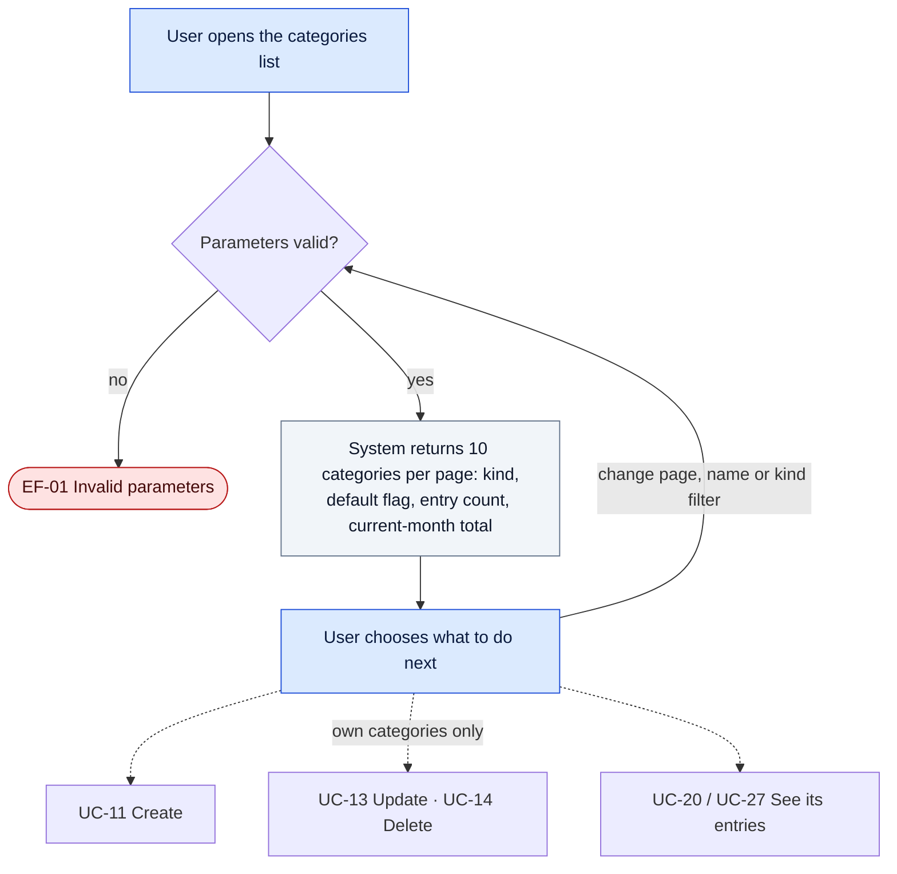
```mermaid
flowchart TD
    A["User opens the categories list"]:::user --> V{"Parameters valid?"}
    V -->|no| E1(["EF-01 Invalid parameters"]):::exc
    V -->|yes| R["System returns 10 categories per page: kind,<br/>default flag, entry count, current-month total"]:::sys
    R --> U["User chooses what to do next"]:::user
    U -->|"change page, name or kind filter"| V
    U -.-> N1["UC-11 Create"]
    U -.->|"own categories only"| N2["UC-13 Update · UC-14 Delete"]
    U -.-> N3["UC-20 / UC-27 See its entries"]
    classDef user fill:#dbeafe,stroke:#1d4ed8,color:#0b1b3f
    classDef sys fill:#f1f5f9,stroke:#64748b,color:#0f172a
    classDef alt fill:#fef3c7,stroke:#b45309,color:#3b2505
    classDef exc fill:#fee2e2,stroke:#b91c1c,color:#450a0a
    classDef ok fill:#dcfce7,stroke:#15803d,color:#052e16
```

### UC-13 — Update a category

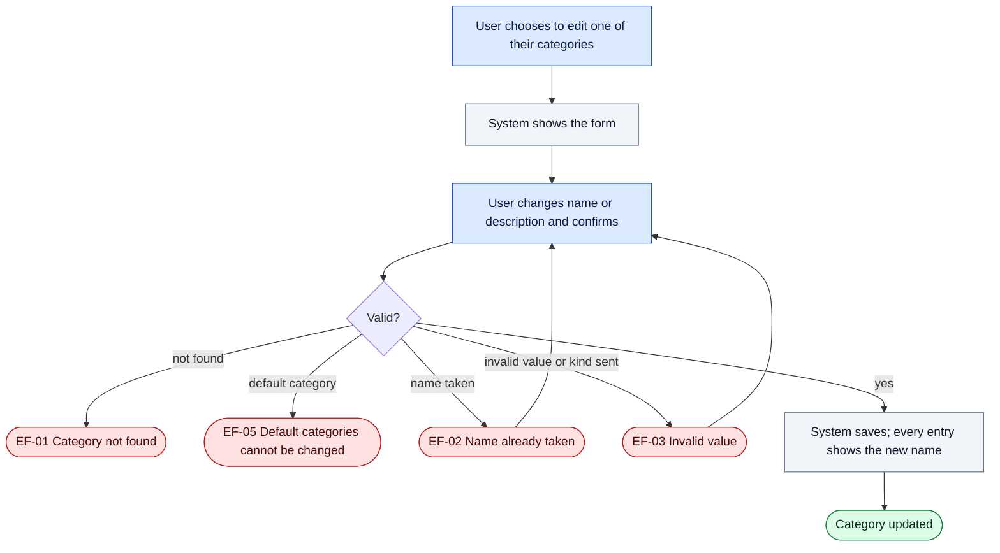
```mermaid
flowchart TD
    A["User chooses to edit one of their categories"]:::user --> B["System shows the form"]:::sys
    B --> C["User changes name or description and confirms"]:::user
    C --> V{"Valid?"}
    V -->|"not found"| E1(["EF-01 Category not found"]):::exc
    V -->|"default category"| E5(["EF-05 Default categories cannot be changed"]):::exc
    V -->|"name taken"| E2(["EF-02 Name already taken"]):::exc --> C
    V -->|"invalid value or kind sent"| E3(["EF-03 Invalid value"]):::exc --> C
    V -->|yes| S["System saves; every entry shows the new name"]:::sys
    S --> OK(["Category updated"]):::ok
    classDef user fill:#dbeafe,stroke:#1d4ed8,color:#0b1b3f
    classDef sys fill:#f1f5f9,stroke:#64748b,color:#0f172a
    classDef alt fill:#fef3c7,stroke:#b45309,color:#3b2505
    classDef exc fill:#fee2e2,stroke:#b91c1c,color:#450a0a
    classDef ok fill:#dcfce7,stroke:#15803d,color:#052e16
```

### UC-14 — Delete a category

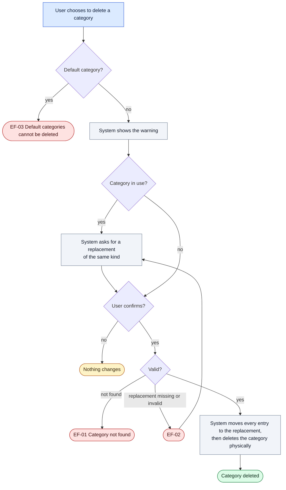
```mermaid
flowchart TD
    A["User chooses to delete a category"]:::user --> D{"Default category?"}
    D -->|yes| E3(["EF-03 Default categories cannot be deleted"]):::exc
    D -->|no| W["System shows the warning"]:::sys
    W --> USED{"Category in use?"}
    USED -->|yes| R["System asks for a replacement<br/>of the same kind"]:::sys --> C
    USED -->|no| C{"User confirms?"}
    C -->|no| CANCEL(["Nothing changes"]):::alt
    C -->|yes| V{"Valid?"}
    V -->|"not found"| E1(["EF-01 Category not found"]):::exc
    V -->|"replacement missing or invalid"| E2(["EF-02"]):::exc --> R
    V -->|yes| S["System moves every entry to the replacement,<br/>then deletes the category physically"]:::sys
    S --> OK(["Category deleted"]):::ok
    classDef user fill:#dbeafe,stroke:#1d4ed8,color:#0b1b3f
    classDef sys fill:#f1f5f9,stroke:#64748b,color:#0f172a
    classDef alt fill:#fef3c7,stroke:#b45309,color:#3b2505
    classDef exc fill:#fee2e2,stroke:#b91c1c,color:#450a0a
    classDef ok fill:#dcfce7,stroke:#15803d,color:#052e16
```

---

## Expenses

### UC-15 — Register a credit card purchase

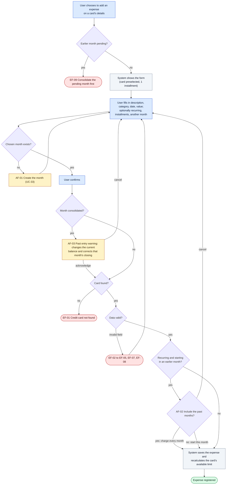
```mermaid
flowchart TD
    A["User chooses to add an expense<br/>on a card's details"]:::user --> L{"Earlier month pending?"}
    L -->|yes| LX(["EF-09 Consolidate the pending month first"]):::exc
    L -->|no| B["System shows the form<br/>(card preselected, 1 installment)"]:::sys
    B --> C["User fills in description, category, date, value;<br/>optionally recurring, installments, another month"]:::user
    C --> M{"Chosen month exists?"}
    M -->|no| AF1["AF-01 Create the month (UC-33)"]:::alt --> C
    M -->|yes| D["User confirms"]:::user
    D --> CM{"Month consolidated?"}
    CM -->|yes| AF3["AF-03 Past entry warning: changes the current<br/>balance and corrects that month's closing"]:::alt
    AF3 -->|cancel| C
    AF3 -->|acknowledge| F
    CM -->|no| F{"Card found?"}
    F -->|no| E1(["EF-01 Credit card not found"]):::exc
    F -->|yes| V{"Data valid?"}
    V -->|"invalid field"| EV(["EF-02 to EF-05, EF-07, EF-08"]):::exc --> C
    V -->|yes| PAST{"Recurring and starting<br/>in an earlier month?"}
    PAST -->|yes| AF2{"AF-02 Include the past months?"}
    AF2 -->|"yes: charge every month"| S
    AF2 -->|"no: start this month"| S
    AF2 -->|cancel| C
    PAST -->|no| S["System saves the expense and<br/>recalculates the card's available limit"]:::sys
    S --> OK(["Expense registered"]):::ok
    classDef user fill:#dbeafe,stroke:#1d4ed8,color:#0b1b3f
    classDef sys fill:#f1f5f9,stroke:#64748b,color:#0f172a
    classDef alt fill:#fef3c7,stroke:#b45309,color:#3b2505
    classDef exc fill:#fee2e2,stroke:#b91c1c,color:#450a0a
    classDef ok fill:#dcfce7,stroke:#15803d,color:#052e16
```

### UC-16 — Register a Pix expense

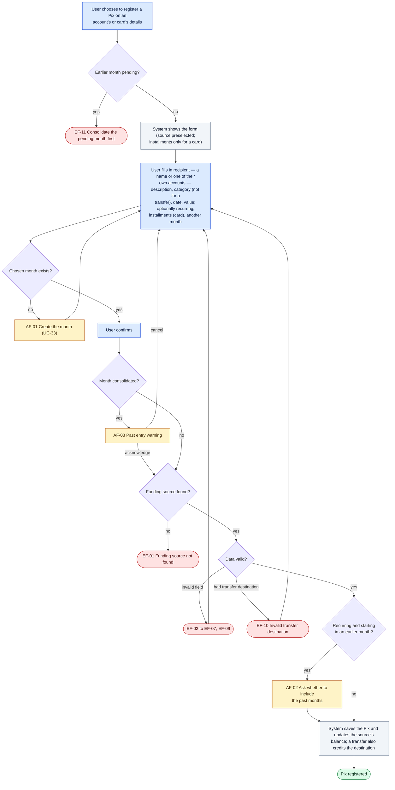
```mermaid
flowchart TD
    A["User chooses to register a Pix on an<br/>account's or card's details"]:::user --> L{"Earlier month pending?"}
    L -->|yes| LX(["EF-11 Consolidate the pending month first"]):::exc
    L -->|no| B["System shows the form (source preselected;<br/>installments only for a card)"]:::sys
    B --> C["User fills in recipient — a name or one of their<br/>own accounts — description, category (not for a<br/>transfer), date, value; optionally recurring,<br/>installments (card), another month"]:::user
    C --> M{"Chosen month exists?"}
    M -->|no| AF1["AF-01 Create the month (UC-33)"]:::alt --> C
    M -->|yes| D["User confirms"]:::user
    D --> CM{"Month consolidated?"}
    CM -->|yes| AF3["AF-03 Past entry warning"]:::alt
    AF3 -->|cancel| C
    AF3 -->|acknowledge| F
    CM -->|no| F{"Funding source found?"}
    F -->|no| E1(["EF-01 Funding source not found"]):::exc
    F -->|yes| V{"Data valid?"}
    V -->|"invalid field"| EV(["EF-02 to EF-07, EF-09"]):::exc --> C
    V -->|"bad transfer destination"| E10(["EF-10 Invalid transfer destination"]):::exc --> C
    V -->|yes| PAST{"Recurring and starting<br/>in an earlier month?"}
    PAST -->|yes| AF2["AF-02 Ask whether to include<br/>the past months"]:::alt --> S
    PAST -->|no| S["System saves the Pix and updates the source's<br/>balance; a transfer also credits the destination"]:::sys
    S --> OK(["Pix registered"]):::ok
    classDef user fill:#dbeafe,stroke:#1d4ed8,color:#0b1b3f
    classDef sys fill:#f1f5f9,stroke:#64748b,color:#0f172a
    classDef alt fill:#fef3c7,stroke:#b45309,color:#3b2505
    classDef exc fill:#fee2e2,stroke:#b91c1c,color:#450a0a
    classDef ok fill:#dcfce7,stroke:#15803d,color:#052e16
```

### UC-17 — Schedule a Pix

```mermaid
flowchart TD
    A["User chooses to schedule a Pix on an<br/>account's or card's details"]:::user --> L{"Earlier month pending?"}
    L -->|yes| LX(["EF-03 Consolidate the pending month first"]):::exc
    L -->|no| B["System shows the Pix form (UC-16)<br/>accepting only future dates"]:::sys
    B --> C["User fills in the Pix as in UC-16,<br/>with a future date"]:::user
    C --> M{"Chosen month exists?"}
    M -->|no| AF1["AF-01 Create the month (UC-33)"]:::alt --> C
    M -->|yes| D["User confirms"]:::user
    D --> V{"Valid, with a future date?"}
    V -->|"date not in the future"| E1(["EF-01 Use Register a Pix instead"]):::exc --> C
    V -->|"other invalid data"| EU(["Exceptions of UC-16"]):::exc --> C
    V -->|yes| S["System stores the Pix as scheduled;<br/>no balance changes yet"]:::sys
    S --> OK(["Pix scheduled — counts on its date (UC-42)"]):::ok
    classDef user fill:#dbeafe,stroke:#1d4ed8,color:#0b1b3f
    classDef sys fill:#f1f5f9,stroke:#64748b,color:#0f172a
    classDef alt fill:#fef3c7,stroke:#b45309,color:#3b2505
    classDef exc fill:#fee2e2,stroke:#b91c1c,color:#450a0a
    classDef ok fill:#dcfce7,stroke:#15803d,color:#052e16
```

### UC-18 — View expense details

```mermaid
flowchart TD
    A["User selects an expense (account, card,<br/>expenses list, bill, month or home)"]:::user --> F{"Found and not removed?"}
    F -->|no| E1(["EF-01 Expense not found"]):::exc
    F -->|yes| S["System calculates the schedule or next charge,<br/>and shows source, method, recipient, category,<br/>status, month history (recurring), stop periods"]:::sys
    S --> U["User chooses what to do next"]:::user
    U -->|back| BACK(["Where the user came from"]):::ok
    U -.-> N1["UC-19 Edit · UC-21 Remove"]
    U -.->|"recurring"| N2["UC-22 Stop · UC-23 Resume"]
    classDef user fill:#dbeafe,stroke:#1d4ed8,color:#0b1b3f
    classDef sys fill:#f1f5f9,stroke:#64748b,color:#0f172a
    classDef alt fill:#fef3c7,stroke:#b45309,color:#3b2505
    classDef exc fill:#fee2e2,stroke:#b91c1c,color:#450a0a
    classDef ok fill:#dcfce7,stroke:#15803d,color:#052e16
```

### UC-19 — Update an expense

```mermaid
flowchart TD
    A["User chooses to edit the expense"]:::user --> L{"Earlier month pending?"}
    L -->|yes| LX(["EF-10 Consolidate the pending month first"]):::exc
    L -->|no| B["System shows the form (for a recurring value<br/>change: all months or from a month on)"]:::sys
    B --> C["User changes any field"]:::user
    C --> M{"New month exists?"}
    M -->|no| AF2["AF-02 Create the month (UC-33)"]:::alt --> C
    M -->|yes| D["User confirms"]:::user
    D --> W{"Value changed, or the<br/>expense is past?"}
    W -->|yes| AF1["AF-01 Value warning and/or past expense<br/>warning, one acknowledgement"]:::alt
    AF1 -->|cancel| C
    AF1 -->|acknowledge| F
    W -->|no| F{"Expense found?"}
    F -->|no| E1(["EF-01 Expense not found"]):::exc
    F -->|yes| V{"Fields valid?"}
    V -->|"unchangeable field"| E2(["EF-02"]):::exc
    V -->|"invalid field"| EV(["EF-03 to EF-06, EF-08, EF-09, EF-11"]):::exc --> C
    V -->|yes| S["System saves; open months change the current<br/>balance, consolidated months only their closing"]:::sys
    S --> OK(["Expense updated"]):::ok
    classDef user fill:#dbeafe,stroke:#1d4ed8,color:#0b1b3f
    classDef sys fill:#f1f5f9,stroke:#64748b,color:#0f172a
    classDef alt fill:#fef3c7,stroke:#b45309,color:#3b2505
    classDef exc fill:#fee2e2,stroke:#b91c1c,color:#450a0a
    classDef ok fill:#dcfce7,stroke:#15803d,color:#052e16
```

### UC-20 — List expenses

```mermaid
flowchart TD
    A["User opens the expenses list"]:::user --> B["System applies page and filters (source, dates,<br/>months, value, category, status, transfer, refund…)"]:::sys
    B --> V{"Parameters valid?"}
    V -->|no| E1(["EF-01 Invalid parameters"]):::exc
    V -->|yes| R["System returns 10 expenses per page, most recent<br/>first; removed ones never appear"]:::sys
    R --> EMP{"Page empty?"}
    EMP -->|yes| AF1["AF-01 'No expenses yet' or<br/>'No expenses match' + clear filters"]:::alt
    EMP -->|no| SHOW["User sees the expenses"]:::user
    AF1 --> SHOW
    SHOW -->|"change page or filters"| B
    SHOW -.->|"select expense"| U18["UC-18"]
    SHOW -. export .-> U40["UC-40"]
    classDef user fill:#dbeafe,stroke:#1d4ed8,color:#0b1b3f
    classDef sys fill:#f1f5f9,stroke:#64748b,color:#0f172a
    classDef alt fill:#fef3c7,stroke:#b45309,color:#3b2505
    classDef exc fill:#fee2e2,stroke:#b91c1c,color:#450a0a
    classDef ok fill:#dcfce7,stroke:#15803d,color:#052e16
```

### UC-21 — Remove an expense

```mermaid
flowchart TD
    A["User chooses to remove the expense"]:::user --> L{"Earlier month pending?"}
    L -->|yes| LX(["EF-04 Consolidate the pending month first"]):::exc
    L -->|no| R{"Recurring?"}
    R -->|yes| AF1{"AF-01 Remove what?"}
    AF1 -->|"stop instead"| U22["UC-22"]
    AF1 -->|cancel| STAY(["Nothing removed"]):::alt
    AF1 -->|"single month (current by default)"| W
    AF1 -->|"whole expense"| W
    R -->|no| W["System shows the warning: cannot be undone;<br/>changes the balance or bill, or corrects the<br/>closings of consolidated months"]:::sys
    W --> C{"User confirms?"}
    C -->|no| AF2(["AF-02 Removal cancelled"]):::alt
    C -->|yes| F{"Found, and scope/month valid?"}
    F -->|"not found"| E1(["EF-01 Expense not found"]):::exc
    F -->|"invalid scope or month"| E2(["EF-02"]):::exc --> R
    F -->|yes| S["System removes logically; open months change the<br/>current balance, consolidated months their closing"]:::sys
    S --> OK(["Expense removed"]):::ok
    classDef user fill:#dbeafe,stroke:#1d4ed8,color:#0b1b3f
    classDef sys fill:#f1f5f9,stroke:#64748b,color:#0f172a
    classDef alt fill:#fef3c7,stroke:#b45309,color:#3b2505
    classDef exc fill:#fee2e2,stroke:#b91c1c,color:#450a0a
    classDef ok fill:#dcfce7,stroke:#15803d,color:#052e16
```

### UC-22 — Stop a recurring expense or income

```mermaid
flowchart TD
    A["User chooses to stop an active recurring<br/>expense (UC-18) or income (UC-25)"]:::user --> L{"Earlier month pending?"}
    L -->|yes| LX(["EF-04 Consolidate the pending month first"]):::exc
    L -->|no| C{"User confirms?<br/>(no charges until resumed)"}
    C -->|no| CANCEL(["Nothing changes"]):::alt
    C -->|yes| F{"Found and not removed?"}
    F -->|no| E1(["EF-01 Not found"]):::exc
    F -->|yes| RC{"Recurring?"}
    RC -->|no| E2(["EF-02 Only recurring entries can be stopped"]):::exc
    RC -->|yes| S["System marks it stopped today; earlier<br/>charges remain; a new stop period starts"]:::sys
    S --> OK(["Stopped — still visible, marked as stopped"]):::ok
    classDef user fill:#dbeafe,stroke:#1d4ed8,color:#0b1b3f
    classDef sys fill:#f1f5f9,stroke:#64748b,color:#0f172a
    classDef alt fill:#fef3c7,stroke:#b45309,color:#3b2505
    classDef exc fill:#fee2e2,stroke:#b91c1c,color:#450a0a
    classDef ok fill:#dcfce7,stroke:#15803d,color:#052e16
```

### UC-23 — Resume a recurring expense or income

```mermaid
flowchart TD
    A["User chooses to resume a stopped recurring<br/>expense (UC-18) or income (UC-25)"]:::user --> L{"Earlier month pending?"}
    L -->|yes| LX(["EF-04 Consolidate the pending month first"]):::exc
    L -->|no| C{"User confirms?<br/>(shows the next charge date)"}
    C -->|no| CANCEL(["Nothing changes"]):::alt
    C -->|yes| F{"Found and not removed?"}
    F -->|no| E1(["EF-01 Not found"]):::exc
    F -->|yes| RC{"Recurring?"}
    RC -->|no| E2(["EF-02 Only recurring entries can be resumed"]):::exc
    RC -->|yes| S["System makes it active again and ends the stop<br/>period today; stopped months stay without charges"]:::sys
    S --> OK(["Active — charged again from its next date"]):::ok
    classDef user fill:#dbeafe,stroke:#1d4ed8,color:#0b1b3f
    classDef sys fill:#f1f5f9,stroke:#64748b,color:#0f172a
    classDef alt fill:#fef3c7,stroke:#b45309,color:#3b2505
    classDef exc fill:#fee2e2,stroke:#b91c1c,color:#450a0a
    classDef ok fill:#dcfce7,stroke:#15803d,color:#052e16
```

---

## Incomes

### UC-24 — Register an income

```mermaid
flowchart TD
    A["User chooses to register an income<br/>on an account's details"]:::user --> L{"Earlier month pending?"}
    L -->|yes| LX(["EF-07 Consolidate the pending month first"]):::exc
    L -->|no| B["System shows the form (account and<br/>current month preselected)"]:::sys
    B --> C["User fills in description, income category, date,<br/>value; optionally recurring or another month"]:::user
    C --> M{"Chosen month exists?"}
    M -->|no| AF1["AF-01 Create the month (UC-33)"]:::alt --> C
    M -->|yes| D["User confirms"]:::user
    D --> CM{"Month consolidated?"}
    CM -->|yes| AF2["AF-02 Past entry warning"]:::alt
    AF2 -->|cancel| C
    AF2 -->|acknowledge| PAST
    CM -->|no| PAST{"Recurring and starting<br/>in an earlier month?"}
    PAST -->|yes| AF3["AF-03 Ask whether to include<br/>the past months"]:::alt --> F
    PAST -->|no| F{"Account found?"}
    F -->|no| E1(["EF-01 Bank account not found"]):::exc
    F -->|yes| V{"Data valid?"}
    V -->|"invalid field"| EV(["EF-02 to EF-04, EF-06"]):::exc --> C
    V -->|yes| S["System saves the income and<br/>raises the account's balance"]:::sys
    S --> OK(["Income registered"]):::ok
    classDef user fill:#dbeafe,stroke:#1d4ed8,color:#0b1b3f
    classDef sys fill:#f1f5f9,stroke:#64748b,color:#0f172a
    classDef alt fill:#fef3c7,stroke:#b45309,color:#3b2505
    classDef exc fill:#fee2e2,stroke:#b91c1c,color:#450a0a
    classDef ok fill:#dcfce7,stroke:#15803d,color:#052e16
```

### UC-25 — View income details

```mermaid
flowchart TD
    A["User selects an income (account, incomes<br/>list, accounting month or home)"]:::user --> F{"Found and not removed?"}
    F -->|no| E1(["EF-01 Income not found"]):::exc
    F -->|yes| S["System shows account, description, category,<br/>date, value, month; for a recurring income its<br/>status, next receipt, stop periods and month history"]:::sys
    S --> U["User chooses what to do next"]:::user
    U -->|back| BACK(["Where the user came from"]):::ok
    U -.-> N1["UC-26 Edit · UC-28 Remove"]
    U -.->|"recurring"| N2["UC-22 Stop · UC-23 Resume"]
    classDef user fill:#dbeafe,stroke:#1d4ed8,color:#0b1b3f
    classDef sys fill:#f1f5f9,stroke:#64748b,color:#0f172a
    classDef alt fill:#fef3c7,stroke:#b45309,color:#3b2505
    classDef exc fill:#fee2e2,stroke:#b91c1c,color:#450a0a
    classDef ok fill:#dcfce7,stroke:#15803d,color:#052e16
```

### UC-26 — Update an income

```mermaid
flowchart TD
    A["User chooses to edit the income"]:::user --> L{"Earlier month pending?"}
    L -->|yes| LX(["EF-04 Consolidate the pending month first"]):::exc
    L -->|no| B["System shows the form"]:::sys
    B --> C["User changes any field (recurring value:<br/>all months or from a month on)"]:::user
    C --> M{"New month exists?"}
    M -->|no| AF2["AF-02 Create the month (UC-33)"]:::alt --> C
    M -->|yes| D["User confirms"]:::user
    D --> W{"In a consolidated month<br/>before or after the change?"}
    W -->|yes| AF1["AF-01 Past entry warning"]:::alt
    AF1 -->|cancel| C
    AF1 -->|acknowledge| F
    W -->|no| F{"Found and valid?"}
    F -->|"not found"| E1(["EF-01 Income not found"]):::exc
    F -->|"unchangeable field"| E2(["EF-02"]):::exc
    F -->|"invalid field"| EV(["Exceptions of UC-24"]):::exc --> C
    F -->|yes| S["System saves; open months change the current<br/>balance, consolidated months only their closing"]:::sys
    S --> OK(["Income updated"]):::ok
    classDef user fill:#dbeafe,stroke:#1d4ed8,color:#0b1b3f
    classDef sys fill:#f1f5f9,stroke:#64748b,color:#0f172a
    classDef alt fill:#fef3c7,stroke:#b45309,color:#3b2505
    classDef exc fill:#fee2e2,stroke:#b91c1c,color:#450a0a
    classDef ok fill:#dcfce7,stroke:#15803d,color:#052e16
```

### UC-27 — List incomes

```mermaid
flowchart TD
    A["User opens the incomes list"]:::user --> V{"Parameters valid?"}
    V -->|no| E1(["EF-01 Invalid parameters"]):::exc
    V -->|yes| R["System returns 10 incomes per page, most recent<br/>first, filtered by account, category, dates,<br/>months, value, recurring, status"]:::sys
    R --> U["User chooses what to do next"]:::user
    U -->|"change page or filters"| V
    U -.->|"select income"| U25["UC-25"]
    U -. export .-> U40["UC-40"]
    classDef user fill:#dbeafe,stroke:#1d4ed8,color:#0b1b3f
    classDef sys fill:#f1f5f9,stroke:#64748b,color:#0f172a
    classDef alt fill:#fef3c7,stroke:#b45309,color:#3b2505
    classDef exc fill:#fee2e2,stroke:#b91c1c,color:#450a0a
    classDef ok fill:#dcfce7,stroke:#15803d,color:#052e16
```

### UC-28 — Remove an income

```mermaid
flowchart TD
    A["User chooses to remove the income"]:::user --> L{"Earlier month pending?"}
    L -->|yes| LX(["EF-04 Consolidate the pending month first"]):::exc
    L -->|no| R{"Recurring?"}
    R -->|yes| AF1{"AF-01 Remove what?"}
    AF1 -->|"stop instead"| U22["UC-22"]
    AF1 -->|cancel| STAY(["Nothing removed"]):::alt
    AF1 -->|"single month / whole income"| W
    R -->|no| W["System shows the warning: cannot be undone;<br/>lowers the balance, or corrects a consolidated closing"]:::sys
    W --> C{"User confirms?"}
    C -->|no| CANCEL(["Nothing changes"]):::alt
    C -->|yes| F{"Found, and scope/month valid?"}
    F -->|"not found"| E1(["EF-01 Income not found"]):::exc
    F -->|"invalid scope or month"| E3(["EF-03"]):::exc --> R
    F -->|yes| S["System removes logically and recalculates<br/>the balance or the closing"]:::sys
    S --> OK(["Income removed"]):::ok
    classDef user fill:#dbeafe,stroke:#1d4ed8,color:#0b1b3f
    classDef sys fill:#f1f5f9,stroke:#64748b,color:#0f172a
    classDef alt fill:#fef3c7,stroke:#b45309,color:#3b2505
    classDef exc fill:#fee2e2,stroke:#b91c1c,color:#450a0a
    classDef ok fill:#dcfce7,stroke:#15803d,color:#052e16
```

---

## Credit card bills

### UC-29 — View a credit card bill

```mermaid
flowchart TD
    A["User opens a card's bill (card, month<br/>view or bill due reminder)"]:::user --> V{"Card found and<br/>parameters valid?"}
    V -->|"card not found"| E1(["EF-01 Card not found"]):::exc
    V -->|"invalid month or page"| E2(["EF-02 Invalid parameters"]):::exc
    V -->|yes| S["System gathers the month's charges and refunds, the<br/>carried amount, payments, total, outstanding, due<br/>date and status — a forecast for a future month"]:::sys
    S --> U["User chooses what to do next"]:::user
    U -->|"previous / next bill or page"| V
    U -.-> N1["UC-18 Open a line's expense"]
    U -.-> N2["UC-30 Pay · UC-31 Remove a payment"]
    classDef user fill:#dbeafe,stroke:#1d4ed8,color:#0b1b3f
    classDef sys fill:#f1f5f9,stroke:#64748b,color:#0f172a
    classDef alt fill:#fef3c7,stroke:#b45309,color:#3b2505
    classDef exc fill:#fee2e2,stroke:#b91c1c,color:#450a0a
    classDef ok fill:#dcfce7,stroke:#15803d,color:#052e16
```

### UC-30 — Pay a credit card bill

```mermaid
flowchart TD
    A["User chooses to pay a bill"]:::user --> L{"Earlier month pending?"}
    L -->|yes| LX(["EF-05 Consolidate the pending month first"]):::exc
    L -->|no| B["System shows the outstanding amount, due date<br/>and the card's own bank account (not choosable)"]:::sys
    B --> C["User confirms or changes amount,<br/>date and accounting month"]:::user
    C --> M{"Chosen month exists?"}
    M -->|no| AF1["AF-01 Create the month (UC-33)"]:::alt --> C
    M -->|yes| D["User confirms"]:::user
    D --> CM{"Month consolidated?"}
    CM -->|yes| AF2["AF-02 Past entry warning"]:::alt
    AF2 -->|cancel| C
    AF2 -->|acknowledge| V
    CM -->|no| V{"Valid?"}
    V -->|"card or bill not found"| E1(["EF-01 Not found"]):::exc
    V -->|"amount ≤ 0 or > outstanding"| E2(["EF-02 Invalid amount"]):::exc --> C
    V -->|"date invalid or future"| E3(["EF-03 Invalid date"]):::exc --> C
    V -->|yes| S["System records the payment: account balance ↓,<br/>card available limit ↑, bill status updated"]:::sys
    S --> OK(["Payment registered"]):::ok
    classDef user fill:#dbeafe,stroke:#1d4ed8,color:#0b1b3f
    classDef sys fill:#f1f5f9,stroke:#64748b,color:#0f172a
    classDef alt fill:#fef3c7,stroke:#b45309,color:#3b2505
    classDef exc fill:#fee2e2,stroke:#b91c1c,color:#450a0a
    classDef ok fill:#dcfce7,stroke:#15803d,color:#052e16
```

### UC-31 — Remove a bill payment

```mermaid
flowchart TD
    A["User chooses to remove a payment on a bill"]:::user --> L{"Earlier month pending?"}
    L -->|yes| LX(["EF-03 Consolidate the pending month first"]):::exc
    L -->|no| W["System shows the warning: cannot be undone;<br/>account balance ↑, available limit ↓,<br/>bill may become partially paid or overdue"]:::sys
    W --> C{"User confirms?"}
    C -->|no| CANCEL(["Nothing changes"]):::alt
    C -->|yes| F{"Payment found?"}
    F -->|no| E1(["EF-01 Payment not found"]):::exc
    F -->|yes| S["System removes the payment logically and<br/>recalculates both balances and the bill's status"]:::sys
    S --> OK(["Payment removed"]):::ok
    classDef user fill:#dbeafe,stroke:#1d4ed8,color:#0b1b3f
    classDef sys fill:#f1f5f9,stroke:#64748b,color:#0f172a
    classDef alt fill:#fef3c7,stroke:#b45309,color:#3b2505
    classDef exc fill:#fee2e2,stroke:#b91c1c,color:#450a0a
    classDef ok fill:#dcfce7,stroke:#15803d,color:#052e16
```

### UC-32 — Register a credit card refund

```mermaid
flowchart TD
    A["User chooses to register a refund on a card's<br/>details (or from an imported credit line)"]:::user --> L{"Earlier month pending?"}
    L -->|yes| LX(["EF-03 Consolidate the pending month first"]):::exc
    L -->|no| C["User fills in description, value, date, category;<br/>optionally the refunded expense and another month;<br/>and confirms"]:::user
    C --> M{"Chosen month exists?"}
    M -->|no| AF1["AF-01 Create the month (UC-33)"]:::alt --> C
    M -->|yes| CM{"Month consolidated?"}
    CM -->|yes| AF2["AF-02 Past entry warning"]:::alt
    AF2 -->|cancel| C
    AF2 -->|acknowledge| V
    CM -->|no| V{"Valid?"}
    V -->|no| E1(["EF-01 Invalid data"]):::exc --> C
    V -->|yes| S["System records the refund: bill of the month ↓,<br/>available limit ↑, category total ↓"]:::sys
    S --> OK(["Refund registered"]):::ok
    classDef user fill:#dbeafe,stroke:#1d4ed8,color:#0b1b3f
    classDef sys fill:#f1f5f9,stroke:#64748b,color:#0f172a
    classDef alt fill:#fef3c7,stroke:#b45309,color:#3b2505
    classDef exc fill:#fee2e2,stroke:#b91c1c,color:#450a0a
    classDef ok fill:#dcfce7,stroke:#15803d,color:#052e16
```

---

## Accounting months

### UC-33 — Create an accounting month

```mermaid
flowchart TD
    A["User picks a month that does not exist — inside<br/>another flow, or on the accounting month view"]:::user --> B["System asks to create it, showing its period"]:::sys
    B --> C{"User confirms?"}
    C -->|no| CANCEL(["Nothing created; the calling flow<br/>cannot use that month"]):::alt
    C -->|yes| V{"Valid YYYY-MM?"}
    V -->|no| E1(["EF-01 Invalid month"]):::exc --> B
    V -->|yes| EX{"Already exists?"}
    EX -->|yes| SAME(["Nothing changes (at most one per month)"]):::ok
    EX -->|no| S["System creates it, open"]:::sys
    S --> OK(["Back to the calling flow with the month<br/>chosen, or to the month's view"]):::ok
    classDef user fill:#dbeafe,stroke:#1d4ed8,color:#0b1b3f
    classDef sys fill:#f1f5f9,stroke:#64748b,color:#0f172a
    classDef alt fill:#fef3c7,stroke:#b45309,color:#3b2505
    classDef exc fill:#fee2e2,stroke:#b91c1c,color:#450a0a
    classDef ok fill:#dcfce7,stroke:#15803d,color:#052e16
```

### UC-34 — Delete an accounting month

```mermaid
flowchart TD
    A["User chooses to delete a month<br/>on its view"]:::user --> E{"Empty? (no charge or receipt,<br/>forecast ones included)"}
    E -->|no| E1(["EF-01 Month not empty — see its entries"]):::exc
    E -->|yes| C{"User confirms?"}
    C -->|no| CANCEL(["Nothing changes"]):::alt
    C -->|yes| S["System deletes the month physically<br/>(a consolidated one loses its closing)"]:::sys
    S --> OK(["Month shown as not created"]):::ok
    classDef user fill:#dbeafe,stroke:#1d4ed8,color:#0b1b3f
    classDef sys fill:#f1f5f9,stroke:#64748b,color:#0f172a
    classDef alt fill:#fef3c7,stroke:#b45309,color:#3b2505
    classDef exc fill:#fee2e2,stroke:#b91c1c,color:#450a0a
    classDef ok fill:#dcfce7,stroke:#15803d,color:#052e16
```

### UC-35 — Set the accounting month closing day

```mermaid
flowchart TD
    A["User opens the accounting month settings"]:::user --> B["System shows the current closing day"]:::sys
    B --> C["User enters a new closing day and confirms"]:::user
    C --> V{"Integer from 1 to 31?"}
    V -->|no| E1(["EF-01 Invalid closing day"]):::exc --> C
    V -->|yes| S["System stores it: periods of open and not-created<br/>months change; no charge moves month"]:::sys
    S --> OK(["Closing day set"]):::ok
    classDef user fill:#dbeafe,stroke:#1d4ed8,color:#0b1b3f
    classDef sys fill:#f1f5f9,stroke:#64748b,color:#0f172a
    classDef alt fill:#fef3c7,stroke:#b45309,color:#3b2505
    classDef exc fill:#fee2e2,stroke:#b91c1c,color:#450a0a
    classDef ok fill:#dcfce7,stroke:#15803d,color:#052e16
```

### UC-36 — Consolidate an accounting month

```mermaid
flowchart TD
    A["Pending month reminder, or the user chooses<br/>to consolidate on a month's view"]:::user --> B["System shows total spent and received<br/>and the amount per source"]:::sys
    B --> EARLY{"Period not ended yet?"}
    EARLY -->|yes| AF1["AF-01 Also lists the charges and receipts<br/>still to come (future corrections)"]:::alt --> C
    EARLY -->|no| C{"User confirms?"}
    C -->|no| CANCEL(["Nothing changes"]):::alt
    C -->|yes| V{"Earliest open month?"}
    V -->|no| E1(["EF-01 Consolidate the earlier month first"]):::exc
    V -->|yes| S["System takes the closing (totals, per source,<br/>bills, transfers) and marks it consolidated"]:::sys
    S --> OK(["Month consolidated — later months unlocked"]):::ok
    classDef user fill:#dbeafe,stroke:#1d4ed8,color:#0b1b3f
    classDef sys fill:#f1f5f9,stroke:#64748b,color:#0f172a
    classDef alt fill:#fef3c7,stroke:#b45309,color:#3b2505
    classDef exc fill:#fee2e2,stroke:#b91c1c,color:#450a0a
    classDef ok fill:#dcfce7,stroke:#15803d,color:#052e16
```

### UC-37 — View an accounting month

```mermaid
flowchart TD
    A["User opens the accounting months menu<br/>(current month by default)"]:::user --> V{"Month and page valid?"}
    V -->|no| E1(["EF-01 Invalid month or page"]):::exc
    V -->|yes| S["System gathers the month: period, history or forecast,<br/>status, totals, by category, comparison with the<br/>previous month, bills, charges, incomes, closing"]:::sys
    S --> P{"Pending months?"}
    P -->|yes| REM["System shows the pending reminder"]:::sys --> U
    P -->|no| U["User chooses what to do next"]:::user
    U -->|"another month or page"| V
    U -.-> N1["UC-18 Charge · UC-25 Income"]
    U -.->|"not created"| N2["UC-33 Create"]
    U -.->|"empty"| N3["UC-34 Delete"]
    U -.->|"earliest open"| N4["UC-36 Consolidate"]
    U -.-> N5["UC-40 Export"]
    classDef user fill:#dbeafe,stroke:#1d4ed8,color:#0b1b3f
    classDef sys fill:#f1f5f9,stroke:#64748b,color:#0f172a
    classDef alt fill:#fef3c7,stroke:#b45309,color:#3b2505
    classDef exc fill:#fee2e2,stroke:#b91c1c,color:#450a0a
    classDef ok fill:#dcfce7,stroke:#15803d,color:#052e16
```

---

## Overview and tools

### UC-38 — View the home summary

```mermaid
flowchart TD
    A["User signs in, or opens the home summary"]:::user --> N{"Has a bank account?"}
    N -->|no| AF1["AF-01 First steps: create a bank account (UC-01)"]:::alt
    N -->|yes| S["System gathers balances and projected balances,<br/>available limits, current month with comparison,<br/>next 7 days, reminders"]:::sys
    S --> U["User sees the summary"]:::user
    U -.-> R1["Pending month → UC-36"]
    U -.-> R2["Scheduled Pix / recurring entry → UC-18 / UC-25"]
    U -.-> R3["Bill due or overdue → UC-30"]
    U -.-> R4["Account → UC-03 · Card → UC-07 · Month → UC-37"]
    classDef user fill:#dbeafe,stroke:#1d4ed8,color:#0b1b3f
    classDef sys fill:#f1f5f9,stroke:#64748b,color:#0f172a
    classDef alt fill:#fef3c7,stroke:#b45309,color:#3b2505
    classDef exc fill:#fee2e2,stroke:#b91c1c,color:#450a0a
    classDef ok fill:#dcfce7,stroke:#15803d,color:#052e16
```

### UC-39 — Import a credit card statement

```mermaid
flowchart TD
    A["User chooses to import a statement on a<br/>card's details and selects the file"]:::user --> L{"Earlier month pending?"}
    L -->|yes| LX(["EF-04 Consolidate the pending month first"]):::exc
    L -->|no| R{"File readable? (Nubank CSV,<br/>or generic CSV with column mapping)"}
    R -->|no| E1(["EF-01 Unreadable file"]):::exc
    R -->|yes| M["System asks for the import's accounting month"]:::sys
    M --> MX{"Month exists?"}
    MX -->|no| AF1["AF-01 Create the month (UC-33)"]:::alt --> M
    MX -->|yes| REV["System shows the review list: suggested categories,<br/>duplicates unselected, installment lines, payment<br/>lines (→ bill payment), credit lines (→ refund)"]:::sys
    REV --> U["User edits lines and selects / unselects them"]:::user
    U --> C{"User confirms?"}
    C -->|no| CANCEL(["Nothing registered"]):::alt
    C -->|yes| CM{"Any line in a<br/>consolidated month?"}
    CM -->|yes| AF2["AF-02 Past expense warning"]:::alt
    AF2 -->|cancel| U
    AF2 -->|acknowledge| V
    CM -->|no| V{"Every selected line valid?"}
    V -->|no| E2(["EF-02 Invalid lines marked"]):::exc --> U
    V -->|yes| S["System registers purchases (UC-15), bill payments<br/>(UC-30) and refunds (UC-32), and shows the result"]:::sys
    S --> OK(["Statement imported"]):::ok
    classDef user fill:#dbeafe,stroke:#1d4ed8,color:#0b1b3f
    classDef sys fill:#f1f5f9,stroke:#64748b,color:#0f172a
    classDef alt fill:#fef3c7,stroke:#b45309,color:#3b2505
    classDef exc fill:#fee2e2,stroke:#b91c1c,color:#450a0a
    classDef ok fill:#dcfce7,stroke:#15803d,color:#052e16
```

### UC-40 — Export data

```mermaid
flowchart TD
    A["User chooses to export on the expenses list,<br/>the incomes list or a month's view, and picks a format"]:::user --> V{"Request valid?"}
    V -->|no| E1(["EF-01 Invalid request"]):::exc
    V -->|yes| S["System produces the file (xlsx, csv or pdf) with every<br/>matching entry — all pages, removed ones excluded"]:::sys
    S --> OK(["User receives the file"]):::ok
    classDef user fill:#dbeafe,stroke:#1d4ed8,color:#0b1b3f
    classDef sys fill:#f1f5f9,stroke:#64748b,color:#0f172a
    classDef alt fill:#fef3c7,stroke:#b45309,color:#3b2505
    classDef exc fill:#fee2e2,stroke:#b91c1c,color:#450a0a
    classDef ok fill:#dcfce7,stroke:#15803d,color:#052e16
```

---

## Automated processes

These run without the user. When and how often they run is still to be
defined; the pending month lock never blocks them.

### UC-41 — Record recurring charges and receipts

```mermaid
flowchart TD
    A["Scheduler starts the process"]:::sys --> B["System finds every active recurring expense and<br/>income with a charge or receipt due and not recorded"]:::sys
    B --> LOOP{"For each one"}
    LOOP --> SKIP{"Removed month or<br/>stopped month?"}
    SKIP -->|yes| NEXT["Skip"]:::sys --> LOOP
    SKIP -->|no| REC["Record it on its date, in its OWN stored month —<br/>even if a month is pending, consolidated or not created"]:::sys
    REC --> CONS{"Its month consolidated?"}
    CONS -->|yes| CORR["Changes the current balance and is<br/>recorded as a correction in the closing"]:::sys --> ERR
    CONS -->|no| ERR{"Recording failed?"}
    ERR -->|yes| E1(["EF-01 Kept for the next run"]):::exc --> LOOP
    ERR -->|no| RM["Create a 'recurring entry made' reminder"]:::sys --> LOOP
    LOOP -->|"none left"| OK(["Process ends — each entry recorded exactly once"]):::ok
    classDef user fill:#dbeafe,stroke:#1d4ed8,color:#0b1b3f
    classDef sys fill:#f1f5f9,stroke:#64748b,color:#0f172a
    classDef alt fill:#fef3c7,stroke:#b45309,color:#3b2505
    classDef exc fill:#fee2e2,stroke:#b91c1c,color:#450a0a
    classDef ok fill:#dcfce7,stroke:#15803d,color:#052e16
```

### UC-42 — Carry out scheduled Pix

```mermaid
flowchart TD
    A["Scheduler starts the process"]:::sys --> B["System finds every scheduled Pix<br/>whose date has arrived"]:::sys
    B --> LOOP{"For each one"}
    LOOP --> S["Make it active and count it on its date,<br/>in its own stored month"]:::sys
    S --> T{"Internal transfer?"}
    T -->|yes| D["Also credit the destination account"]:::sys --> ERR
    T -->|no| ERR{"Failed?"}
    ERR -->|yes| E1(["EF-01 Stays scheduled; retried next run"]):::exc --> LOOP
    ERR -->|no| LOOP
    LOOP -->|"none left"| OK(["Process ends — each Pix counted exactly once"]):::ok
    classDef user fill:#dbeafe,stroke:#1d4ed8,color:#0b1b3f
    classDef sys fill:#f1f5f9,stroke:#64748b,color:#0f172a
    classDef alt fill:#fef3c7,stroke:#b45309,color:#3b2505
    classDef exc fill:#fee2e2,stroke:#b91c1c,color:#450a0a
    classDef ok fill:#dcfce7,stroke:#15803d,color:#052e16
```

### UC-43 — Process bill due dates

```mermaid
flowchart TD
    A["Scheduler starts the process"]:::sys --> B["System finds every bill whose due date has<br/>passed and that is not processed yet"]:::sys
    B --> LOOP{"For each bill"}
    LOOP --> P{"Fully paid?"}
    P -->|yes| PAID["Status → paid"]:::sys --> ERR
    P -->|no| OVD["Status → overdue; unpaid amount carried, as it is,<br/>to the next bill (no fee or interest)"]:::sys --> ERR
    ERR{"Failed?"} -->|yes| E1(["EF-01 Retried next run"]):::exc --> LOOP
    ERR -->|no| LOOP
    LOOP -->|"none left"| OK(["Process ends — each bill processed once"]):::ok
    classDef user fill:#dbeafe,stroke:#1d4ed8,color:#0b1b3f
    classDef sys fill:#f1f5f9,stroke:#64748b,color:#0f172a
    classDef alt fill:#fef3c7,stroke:#b45309,color:#3b2505
    classDef exc fill:#fee2e2,stroke:#b91c1c,color:#450a0a
    classDef ok fill:#dcfce7,stroke:#15803d,color:#052e16
```
